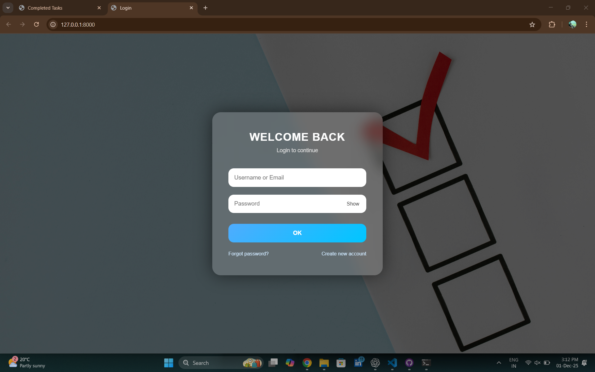
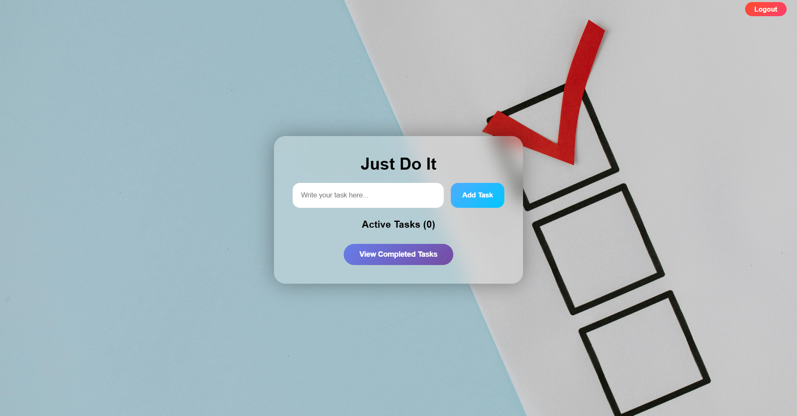
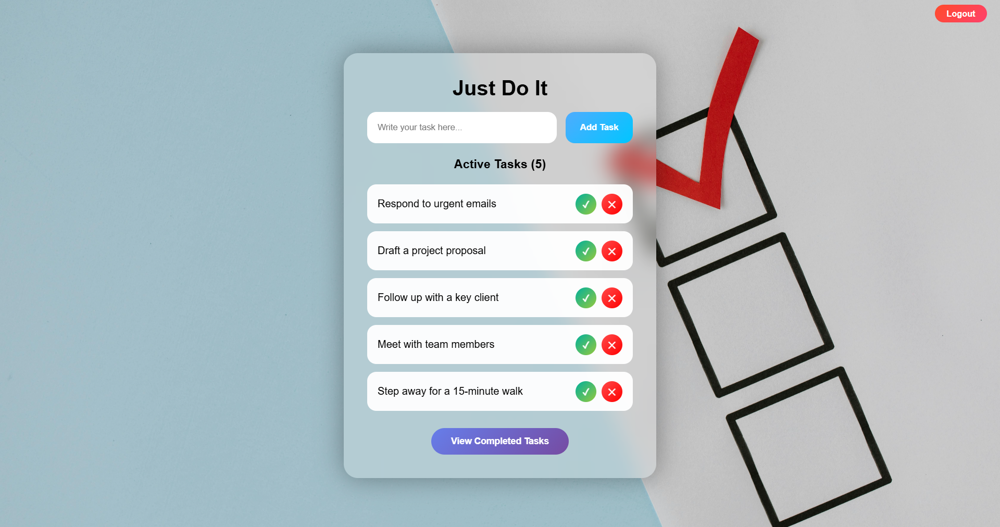
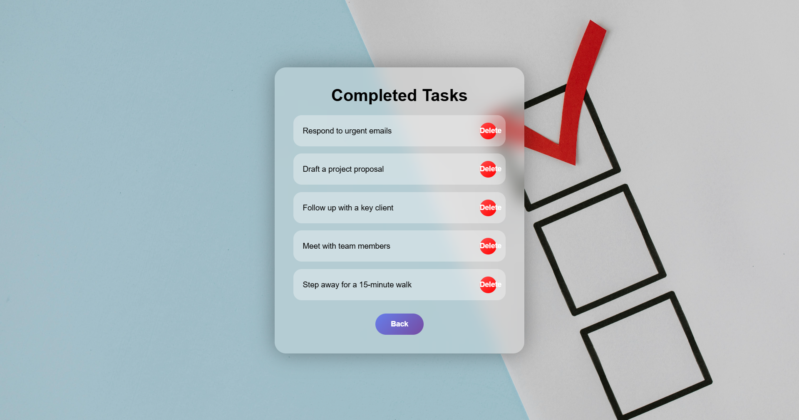

# ✅ TaskMatrix – Modern Todo Web Application

TaskMatrix is a full-stack Todo List Web Application built using FastAPI, HTML, CSS, and JavaScript.  
It allows users to securely log in, create and manage tasks, track progress, and boost productivity with a clean, modern, and animated user interface.

This project is ideal for:
- College projects
- Portfolio showcase
- Internship & job interviews

---

## 🚀 Features

- 🔐 Secure User Login System  
- 📝 Add, Edit & Delete Tasks  
- ✅ Mark Tasks as Completed  
- 📋 Task Dashboard  
- 🌙 Dark Mode UI  
- ⚡ FastAPI High-Performance Backend  
- 💾 Database Integration (SQLite)  
- 🎨 Modern Animated UI  
- 📱 Fully Mobile-Responsive Design  

---

## 🖼️ Screenshots

### 🔐 Login Page

### 📋 Dashboard

### ➕ Add Task

### ✅ Completed Tasks

---

## 🛠️ Tech Stack

### Frontend
- HTML
- CSS
- JavaScript

### Backend
- Python
- FastAPI

### Database
- SQLite

### Tools
- Git
- GitHub
- VS Code

---

## 📂 Project Structure

TaskMatrix/
├── backend/
│   ├── app/
│   ├── venv/
│   ├── requirements.txt
│   └── main.py
│
├── frontend/
│   ├── index.html
│   ├── style.css
│   └── script.js
│
├── screenshots/
│   ├── login.png
│   ├── dashboard.png
│   ├── add_task.png
│   └── completed.png
│
├── .gitignore
├── README.md
└── TaskMatrix.bat

---

## ⚙️ How to Run Locally

### 1️⃣ Clone the Repository

git clone https://github.com/your-username/TaskMatrix.git
cd TaskMatrix

---

### 2️⃣ Run the Backend (FastAPI)

cd backend
python -m venv venv
venv\Scripts\activate
pip install -r requirements.txt
python -m uvicorn app.main:app --reload

Backend will run at:
http://127.0.0.1:8000

---

### 3️⃣ Run the Frontend

If your frontend is plain HTML/CSS/JS:  
Open frontend/index.html in your browser

If it uses npm:

cd frontend
npm install
npm start

---

## 🔄 Application Flow

1. User registers / logs in  
2. User is redirected to dashboard  
3. User adds new tasks  
4. Tasks can be edited or deleted  
5. Tasks can be marked as completed  
6. Completed tasks appear in a separate section  

---

## 📌 Important Notes

- Always start the backend first
- Keep the venv folder after setup
- Screenshot filenames must match exactly:
  - login.png
  - dashboard.png
  - add_task.png
  - completed.png

---

## 🎯 Use Cases

- Daily personal task management  
- Student productivity tracker  
- Portfolio project  
- Interview demonstration project  

---

## 🧑‍💻 Author

Md Danish  
BCA Student | Aspiring Full-Stack Developer  

GitHub:
https://github.com/your-username

---

## ⭐ Support

If you like this project:
- Star the repository  
- Fork it  
- Report issues  
- Suggest new features  

---

## 📜 License

This project is licensed under the MIT License — free to use, modify, and distribute.
